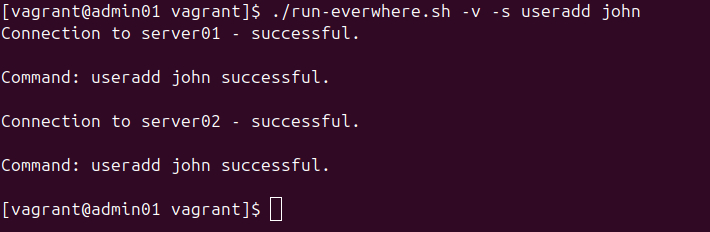

# Remote Execution Script

The idea behind this script is to allow a Linux admin to avoid repetition by using this script to carry out commands on a large network of servers through automation, which improves time efficiency and reduces human errors.

This script allows you to execute commands on multiple servers listed in a file, with various options for control and feedback.

## Features

- Run commands on multiple servers defined in a server file.
- Increase verbosity to display server names before executing commands.
- Enable root privileges on remote servers for command execution (requires `-s` flag).
- Perform a dry run to simulate execution without actually running commands (using `-n` flag).
- Specify a custom server file location using the `-f` flag.

## Prerequisites

This script assumes you've already established SSH key-based authentication on your servers. This involves generating an SSH key pair on your main PC using `ssh-keygen` and distributing the public key to each server using `ssh-copy-id`. This allows the script to connect to the servers without requiring a password for each execution.

## Installation

1. Save the script content as `06_remote_execution.sh`.
2. Grant executable permissions to the script:

   ```bash
   chmod +x 06_remote_execution.sh
   ```

## Server File

The script expects a file containing a list of server hostnames, with one hostname per line. Initially, hostnames were added to the server file using the command echo 'ip server01' | sudo tee -a /etc/hosts. While this approach is suitable for small setups, a more scalable naming convention is recommended for larger organizations. For example, using region-based or function-based names such as us-east-server1, eu-west-server2, database-server, or web-server1 would be more effective.

By default, the script looks for a file named servers located at /vagrant/06_own_servers. You can modify the script to use a different file location by using the -f option (see the Usage section below).

## Usage

```bash
./06_remote_execution.sh [-vsn] [-f SERVER_FILE] COMMAND
```

### Options

- `-v`: Enables verbose mode, displaying server names before executing commands.
- `-s`: Enables execution of commands with root privileges on the remote servers. (**Use with caution!**)
- `-n`: Performs a dry run, simulating command execution without actually running them.
- `-f SERVER_FILE`: Specifies a custom server file location. (Default: `/vagrant/servers`)
- `COMMAND`: The command you want to execute on all the servers. (Required)

### Example Usage

1. Update package lists on all servers (dry run):

   ```bash
   ./06_remote_execution.sh -n apt update
   ```

   

2. Reboot all servers with root privileges:

   ```bash
   ./06_remote_execution.sh -v -s useradd john
   ```

   

3. Run a custom command with verbosity enabled:

   ```bash
   ./06_remote_execution.sh -v id john
   ```

   

## Script Details

### Security

- Using the `-s` option grants root privileges on remote servers. **Use this option with caution and only on trusted systems.** Make sure you've properly set up SSH key-based authentication before using this script.

### Error Handling

- The script checks if the `SERVER_FILE` exists and is readable. If not, it outputs an error message and exits.
- The script verifies that it is not being run as the superuser (root) directly. Instead, it requires the `-s` option to enable root privileges for remote commands.
- Connection attempts to each server are made with a 2-second timeout. If the connection fails, an error message is displayed.
- If command execution on a server fails, the script captures the exit status and reports the failure.

### Message Outputs

- When verbosity is enabled (`-v`), the script logs messages indicating successful connections and command execution.
- In dry run mode (`-n`), the script simulates the command execution and logs the intended actions without performing them.
- Error messages are sent to standard error (`stderr`) to distinguish them from regular output.

### Customization

- You can modify the script to suit your specific needs, such as changing the default server file location or adding functionalities.

This script provides a convenient way to manage and execute commands on multiple servers simultaneously. Remember to adjust the script and server file according to your environment and security best practices.
